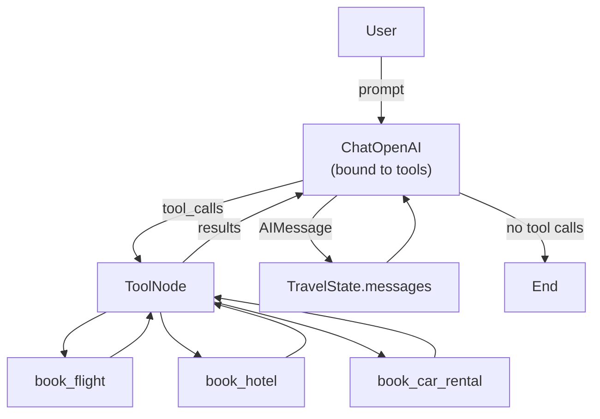

# AI AGENT RESEARCH REPOT.   
# This is a repository of my agentic ai workflows I use in my research.
## There are many projects in this repot and README file to explain everything. I tried my best to separate everything for better organization.


If anyone would like to replicate this, just keep in mind you will have to have your OWN api key to access
any of the LLM's used in this experiment. Also creating your own environmental variables and file
is mandatory as you can not use the ones in this repot.


## Research lab 3: Replicant of myself using Python programming and GPT, then using Google Gemini to evaluate the answer....


###########################################################################################################################################################################################################################################################################################################################################################################################################################################################


# 🧭 LangGraph Travel Orchestrator (LLM + Tools)

[](https://www.python.org/)
[](https://python.langchain.com/)
[](https://langchain-ai.github.io/langgraph/)
[](https://platform.openai.com/)
[](#license)

A minimal-but-solid reference app showing how to wire **LangGraph** + **LangChain** tools with `ChatOpenAI`.  
It handles tool-calling (flight / hotel / car rental), loops through tools until done, and keeps message state tidy.

> _“It books flights. It books hotels. It books cars. It does not, however, pack your suitcase. Yet.”_

---

## ✨ Features
- ⚙️ **Tool binding done right**: `model.bind_tools(tools)` and always call the **bound** model.
- 🔁 **Graph control**: `should_continue` routes between the model and the `ToolNode` until no more tool calls.
- 🧠 **Stateful messages**: `add_messages` makes it easy to accumulate chat history.
- 🧪 **Copy‑paste runnable**: includes a single-file demo to try locally in minutes.

---

## 📦 Quickstart

> Requires **Python 3.10+**.

```bash
# 1) Create & activate a virtual env
python -m venv .venv
# Windows
.venv\Scripts\activate
# macOS/Linux
# source .venv/bin/activate

# 2) Install deps
pip install -U pip
pip install langchain langgraph langchain-openai typing-extensions

# 3) Set your OpenAI key (shell examples)
# PowerShell
$env:OPENAI_API_KEY="sk-..."
# bash/zsh
export OPENAI_API_KEY="sk-..."
```

Create `app.py` with the code below and run:

```bash
python app.py
```

---

## 🧩 Code (single-file demo)

```python
from typing import Literal, TypedDict, Annotated, Sequence
from langchain_openai import ChatOpenAI
from langchain_core.messages import AnyMessage, HumanMessage
from langchain_core.tools import tool
from langgraph.graph import StateGraph, END
from langgraph.graph.message import add_messages
from langgraph.prebuilt import ToolNode

# ---- App state
class TravelState(TypedDict):
    messages: Annotated[Sequence[AnyMessage], add_messages]

# ---- Tools
@tool
def book_flight(destination: str):
    """Book a flight to the specified destination."""
    return {"confirmation": "FL12345whacawhace", "destination": destination}

@tool
def book_hotel(location: str):
    """Book a hotel in the specified location."""
    return {"confirmation": "HT9845346", "location": location}

@tool
def book_car_rental(location: str):
    """Book a car rental in the specified location."""
    return {"confirmation": "CR45234253", "location": location}

tools = [book_flight, book_hotel, book_car_rental]

# ---- Model (bind AFTER tools exist)
model = ChatOpenAI(temperature=0, streaming=True)
bound_model = model.bind_tools(tools)

# ---- Nodes
def call_model(state: TravelState):
    # Always call the bound model so it can emit tool_calls
    response = bound_model.invoke(state["messages"])
    # Wrap in a list so add_messages appender knows to merge
    return {"messages": [response]}

def should_continue(state: TravelState) -> Literal["action", "__end__"]:
    last = state["messages"][-1]
    if getattr(last, "tool_calls", None):
        return "action"
    return "__end__"

tool_node = ToolNode(tools)

# ---- Graph
def build_graph():
    graph = StateGraph(TravelState)
    graph.add_node("model", call_model)
    graph.add_node("action", tool_node)
    graph.set_entry_point("model")

    graph.add_conditional_edges(
        "model",
        should_continue,
        {"action": "action", "__end__": END},
    )
    graph.add_edge("action", "model")
    return graph.compile()

if __name__ == "__main__":
    app = build_graph()
    result = app.invoke({"messages": [HumanMessage(content="Book me a flight to Paris and a hotel near the Louvre.")]})
    for m in result["messages"]:
        print(type(m).__name__, "->", getattr(m, "content", None), getattr(m, "tool_calls", None))
```

---

## 🗺️ Architecture

> GitHub uses a stricter Mermaid version. This block is **GitHub‑safe** (uses `flowchart`, quoted labels, and `<br/>` line breaks).



---

## 🧰 Common Pitfalls & Fixes

- **“NameError: tool is not defined”** → Import first: `from langchain_core.tools import tool`.
- **Tools don’t fire** → You called `model.invoke(...)` instead of `bound_model.invoke(...)`.
- **State doesn’t grow** → Ensure your state uses `Annotated[..., add_messages]` and you return `{"messages": [response]}`.
- **Tool not executed** → You forgot to wire `ToolNode` (and the `action -> model` edge).
- **OpenAI key error** → Set `OPENAI_API_KEY` in your env (no quotes in PowerShell, `export` in bash/zsh).
- **Version mismatch** → Update to recent `langchain`, `langgraph`, and `langchain-openai` packages.

---

## 🧪 Extending
- Add real booking APIs behind the tools (e.g., Amadeus, Expedia Rapid, or your internal services).
- Plug in observability (LangSmith / custom callbacks) to trace tool calls.
- Swap models (e.g., `gpt-4o`, `o4-mini`) by changing the `ChatOpenAI` init params.

---

## 📁 Suggested Repo Layout

```
.
├─ app.py
├─ README.md
├─ requirements.txt  # optional: pin versions
└─ .env              # optional: OPENAI_API_KEY=...
```

---

## 📜 License
MIT — see [LICENSE](LICENSE) if you add one.

---

## 🙌 Credits
Built by **Chris** with an assist from _Mother_ (your friendly repo co-pilot).


